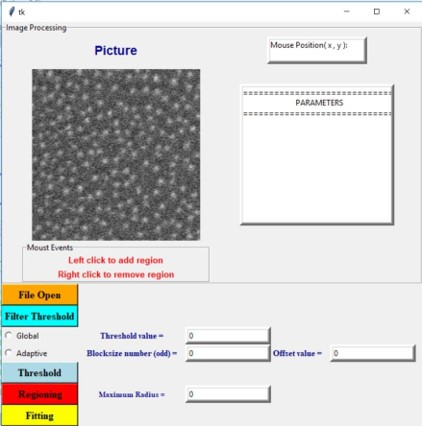
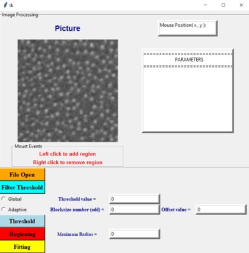
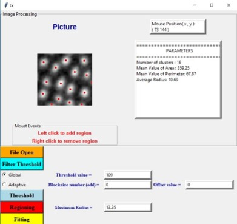
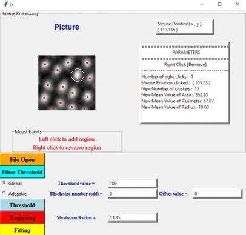
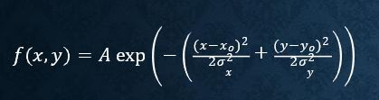
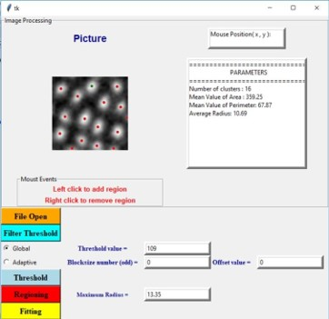
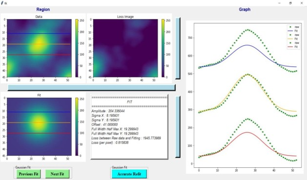
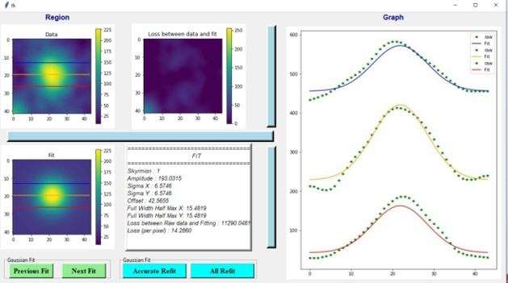
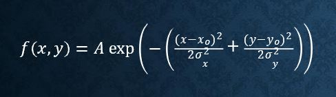
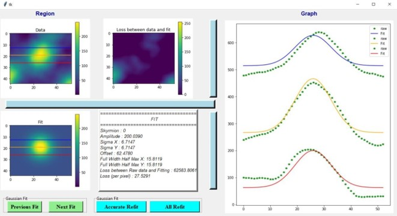

# Skyrmions
A Graphical Usual Interface (GUI) that is able to perform image processing for Skyrmions with the help of Python software.

The code has to be able to read any TIFF or JPG image files since these files are frequently obtained through experiments. If the user wish to filter the image, a Gaussian filter will be used when the 'filter' button is pressed. 

There are three options of image processing that the user can choose to use: 
1. K-means
2. Global
3. Adaptive

These three types of image processing uses different algorithms, however produces the same result of clustering the pixels with the mean intensity value. Hence when the image processing is done, it shows patterns or shapes such as circles.

**Global Threshold.**
Global threshold function uses Otsu's method, which chooses the threshold to minimize the interclass variance of the black and white pixels. Adaptive thresholding typically takes a grayscale or color image as input and, in the simplest implementation, outputs a binary image representing the segmentation. For each pixel in the image, a threshold has to be calculated. If the pixel value is below the threshold it is set to the background value, otherwise it assumes the foreground value. The difference between the three options of image processing is the accuracy of the results and the speed of the running program. Kmeans and Global thresholding have almost the similar algorithm used, however Kmeans is known to be use for RGB (Red Green Blue) images while Global thresholding is used for Grayscale images.
 
## What does the GUI do? ##
1. The user will need to select the folder that all the data files are stored by clicking the 'browse' button.  
The systems would take in an image  preferably in binary or jpeg format.  

2. If the user would wish to filter the image, clicking the 'filter threshold' button will help blur the image through a Gaussian Filter Algorithm.  
The purpose of filtering the image helps to reduce the noise or disturbances being picked up from the experiment, hence not identifying the noises as Skyrmions.  
| Before        | After         |
| --- | --- |
|  |  |  

3. When one of the options Global or adaptive is chosen and the 'threshold' button is clicked, the system will identify the Skyrmions based on criteria or known equations.  

4. Output the properties of the Skyrmions such as area and perimeter when the 'Regioning' button is clicked.  
The algorithms written in the code helps to identify how many regions are there and marks the every parameters about each region which includes the center points, perimeters, areas and orientation.  

5. Mouse events in which to add or remove regions that were identified.  
Mouse events are in placed in the code for easier accessibility and easy to be use by the user.  
**Example of Addition.**  

| Before        | After         |
| --- | --- |
|  |  |  

**Example of Removing.**  

| Before        | After         |
| --- | --- |
|  |  |

6. When the 'Fitting' button is pressed. The curve is then fitted to a 2 dimensional isotropic Gaussian model:  
  
The image will focus on the Skyrmion that is identified and plot the graph according to the intensity value against the x-axis of the image.  
  

7. The 'Next Fit' and 'Previous Fit' buttons helps the user to run through which individual Skyrmion he wishes to look at.  
  

8. When the 'Accurate Refit' button is pressed, it will execute fitting over a given range of window size of the image and the best fit will be selected based on the minimum intensity  
  
  
